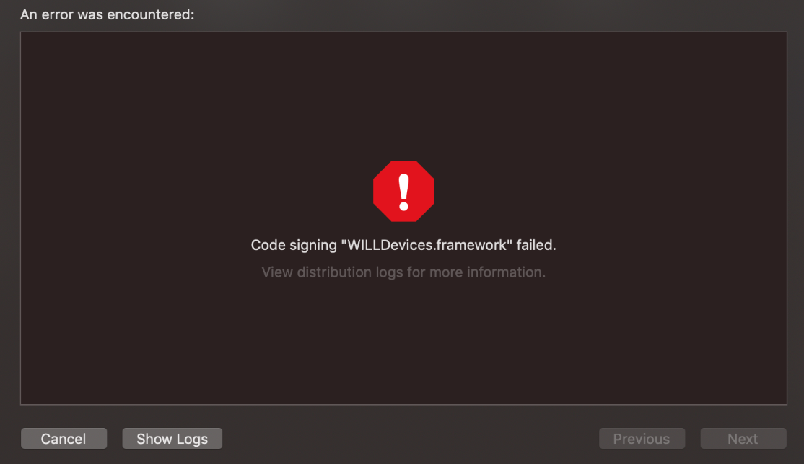
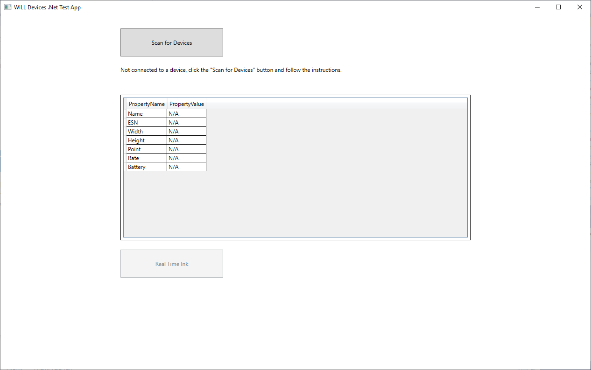
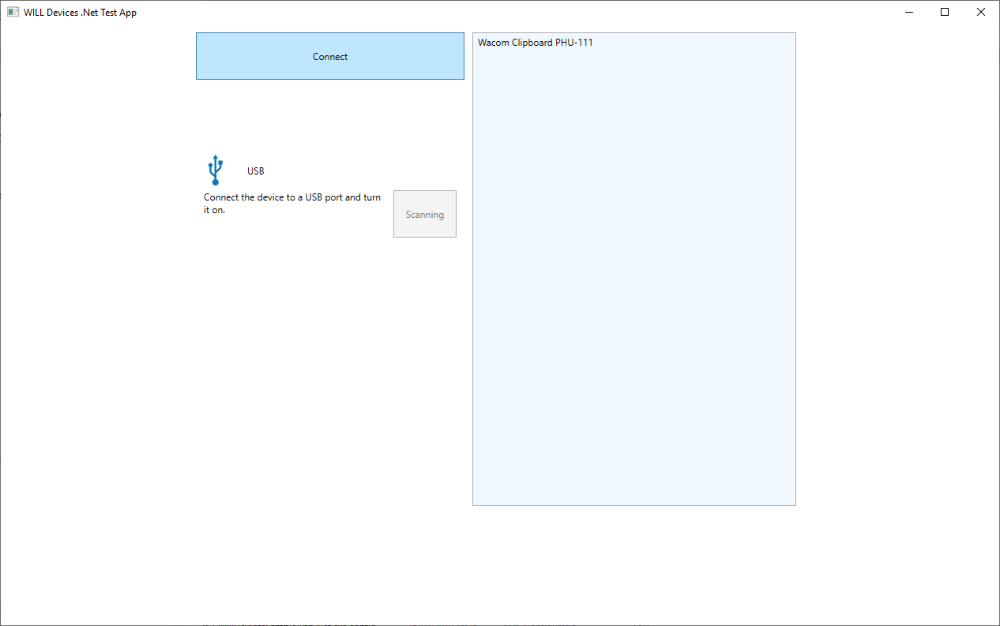
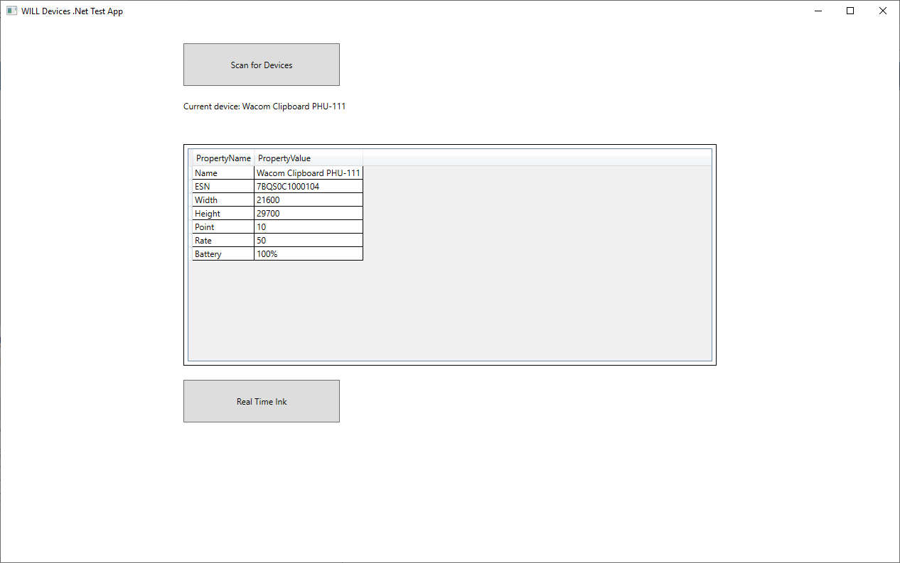
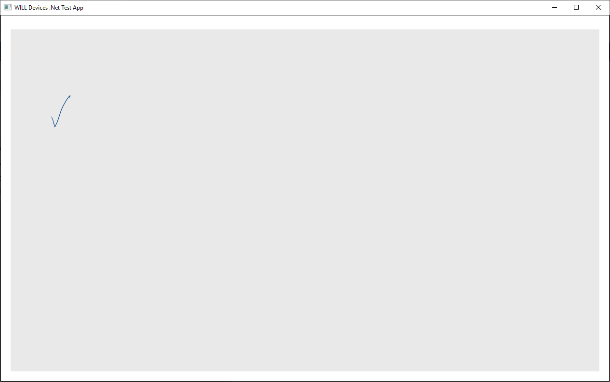
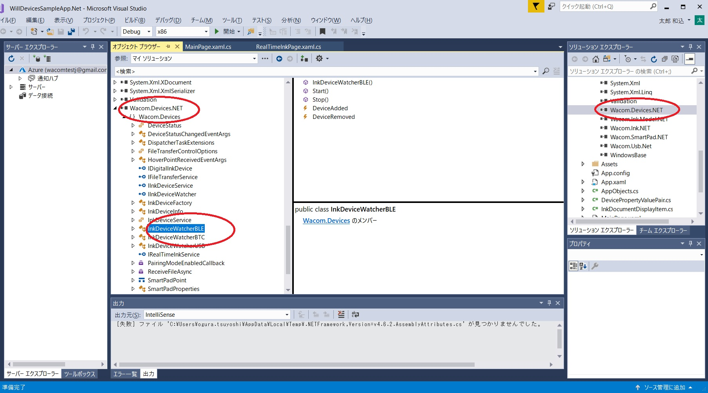
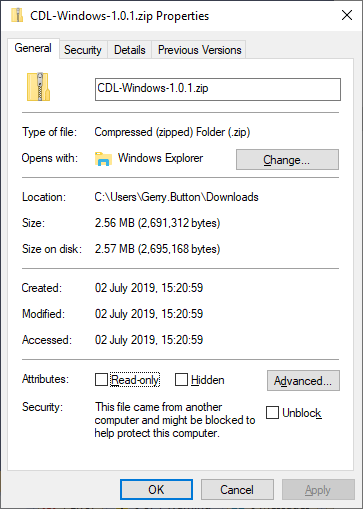

## **General**

## Is the Wacom Ink SDK for devices also called the CDL?

The *Wacom Common Device Library* (CDL) is the library incorporated in the *Wacom SDK for devices SDK*.
The CDL library handles different types of pen or touch input from Wacom and third-party devices.

## How to install a new license

The new license will be supplied as a text string in a download file, for example:

_eyJhbGciOiJSUzUxMiIsInR5cCI6IkpXVCJ9.eyJpc3MiOiJMTVMiLCJleHAiOjE1MzAxODEwMDQsImlhdCI6MTUyMjIzMjIwNCwicmlnaHRzIjpbIkNETF9BQ0NFU1MiLCJDRExfTElWRV9TVFJFQU1JTkciLCJDRExfVEhJUkRQQVJUWV9QRU5TIiwiQ0RMX1BIVV8xMTEiLCJTSUdfU0RLX0NPUkUiLCJTSUdDQVBUWF9BQ0NFU1MiXSwiZGV2aWNlcyI6W10sInR5cGUiOiJldmFsIiwibGljX25hbWUiOiJXSUxMX1NpZ25hdHVyZV9FZGl0aW9uIiwid2Fjb21faWQiOiI0NjFjMjZjMDRlMGQ0YjQyODk1MjNiNDcwZDZiNTJhMSIsImxpY191aWQiOiJiMzFkYjFmMS1lODdjLTQzZGUtODQ4MS1kMzJiNmUyYWRlOGUiLCJhcHBzX3dpbmRvd3MiOltdLCJhcHBzX2lvcyI6W10sImFwcHNfYW5kcm9pZCI6W10sIm1hY2hpbmVfaWRzIjpbXX0.r_ntKX8JHbvE5lIjZgInsv-SbxenS60ymxgXYew8o5l4_UPdMAXxFa0xTNzIrTfb1DbJakLxcLUgeW2FeXnd5oaDt8fLrQDEgCt3SScp92YsCPnVnze7j4GHTVElDNgYtQzMBPAgPUGIg4NbinWZt8YthcDMCQbDFxWVhU3-AQMguGClxuZxxJHOzLp71nSczQ9aYsBMK2vaaMhjqVMt83XHc_MLtFiWoMM08n09oAsZqnkySyqgjPgXzR73ZWOrCcnwSKUU2VDraXIrO7z79UV1JvMYYQq7RtBQizjPRJlPz9YsBDrE8fexShNIzdizDNJliR_6YtHfQ1vKIdvtBA_

The sample code uses the default license in the file **evaluation.lic**.
To install the new license, copy the contents of the downloaded license file to **evaluation.lic**.

---

## Does the CDL support air strokes?

On some devices, when the pen is close to the surface but not making contact its position is reported in the pen data stream.

This is sometimes referred to as ‘air strokes’ or proximity data, where the pen X/Y coordinates are reported with zero force values.

Currently (v1.x) the CDL does not support this data type and the data is filtered out of the WILL Ink Stroke data.

This data will be supported in a future version with RAW data mode.

---
---

## **iOS**

## iOS deployment

When uploading to Apple Store, a project built using the Will Devices Framework can lead to this error:



This results from including unused simulator binaries in the build.  

To resolve the issue strip out the simulator binaries before attempting to upload to Apple Store.

For example add the following script as 'run script' in the builds phases tab in Xcode:  
&nbsp;  
```
echo "Target architectures: $ARCHS"

APP_PATH="${TARGET_BUILD_DIR}/${WRAPPER_NAME}"

find "$APP_PATH" -name '*.framework' -type d | while read -r FRAMEWORK
do
FRAMEWORK_EXECUTABLE_NAME=$(defaults read "$FRAMEWORK/Info.plist" CFBundleExecutable)
FRAMEWORK_EXECUTABLE_PATH="$FRAMEWORK/$FRAMEWORK_EXECUTABLE_NAME"
echo "Executable is $FRAMEWORK_EXECUTABLE_PATH"
echo $(lipo -info "$FRAMEWORK_EXECUTABLE_PATH")

FRAMEWORK_TMP_PATH="$FRAMEWORK_EXECUTABLE_PATH-tmp"

# remove simulator's archs if location is not simulator's directory
case "${TARGET_BUILD_DIR}" in
*"iphonesimulator")
echo "No need to remove archs"
;;
*)
if $(lipo "$FRAMEWORK_EXECUTABLE_PATH" -verify_arch "i386") ; then
lipo -output "$FRAMEWORK_TMP_PATH" -remove "i386" "$FRAMEWORK_EXECUTABLE_PATH"
echo "i386 architecture removed"
rm "$FRAMEWORK_EXECUTABLE_PATH"
mv "$FRAMEWORK_TMP_PATH" "$FRAMEWORK_EXECUTABLE_PATH"
fi
if $(lipo "$FRAMEWORK_EXECUTABLE_PATH" -verify_arch "x86_64") ; then
lipo -output "$FRAMEWORK_TMP_PATH" -remove "x86_64" "$FRAMEWORK_EXECUTABLE_PATH"
echo "x86_64 architecture removed"
rm "$FRAMEWORK_EXECUTABLE_PATH"
mv "$FRAMEWORK_TMP_PATH" "$FRAMEWORK_EXECUTABLE_PATH"
fi
;;
esac

echo "Completed for executable $FRAMEWORK_EXECUTABLE_PATH"
echo $(lipo -info "$FRAMEWORK_EXECUTABLE_PATH")

done
```

---
---
## **Android**

## Android: Bluetooth Connection Caveat

There are some devices (normally low cost) that share the same chipset for WIFI and Bluetooth Low Energy (BLE) and it is not possible to connect both at the same time.

The only solution when this happens is to disconnect one when trying to connect to the other.

---

## Android: Text is lost when another app is brought into focus

In LiveMode while text is displayed on the device, if you switch to another app and then come back to the CDL app, the text is lost.
Is there anyway in which the text can be maintained in memory and not lost when switching between apps?

#### Solution

You need to save the strokes which you are drawing and repaint them when returning from the background.
Here is a Java class which illustrates this:
```
package com.wacom.samples.cdlsampleapp;

import android.graphics.Color;
import android.graphics.Matrix;
import android.support.v7.app.AppCompatActivity;
import android.os.Bundle;
import android.util.Log;
import android.view.SurfaceHolder;
import android.view.SurfaceView;
import android.view.View;
import android.widget.Button;
import android.widget.ImageView;
import android.widget.Toast;
import com.wacom.cdl.callbacks.LiveModeCallback;
import com.wacom.cdl.callbacks.OnCompleteCallback;
import com.wacom.cdl.exceptions.InvalidOperationException;
import com.wacom.cdl.InkDevice;
import com.wacom.cdl.deviceservices.DeviceServiceType;
import com.wacom.cdl.deviceservices.LiveModeDeviceService;
import com.wacom.cdlcore.InkStroke;
import com.wacom.ink.path.PathBuilder;
import com.wacom.ink.path.PathChunk;
import com.wacom.ink.path.PathUtils;
import com.wacom.ink.path.SpeedPathBuilder;
import com.wacom.ink.rasterization.BlendMode;
import com.wacom.ink.rasterization.InkCanvas;
import com.wacom.ink.rasterization.Layer;
import com.wacom.ink.rasterization.SolidColorBrush;
import com.wacom.ink.rasterization.StrokePaint;
import com.wacom.ink.rasterization.StrokeRenderer;
import com.wacom.ink.rendering.EGLRenderingContext;
import com.wacom.ink.smooth.MultiChannelSmoothener;
import com.wacom.samples.cdlsampleapp.model.Stroke;

import java.util.LinkedList;
import java.util.Timer;
import java.util.TimerTask;

@SuppressWarnings("ALL")
public class LiveModeActivity extends AppCompatActivity {

    //region Fields
    // WILL for Devices
    private InkDevice inkDevice;
    private Timer timer = new Timer();
    private TimerTask hideHoverPointTask;
    private ImageView hoverPoint;
    private LiveModeDeviceService liveModeDeviceService;

    // WILL for Ink
    private InkCanvas inkCanvas;
    private Layer strokesLayer;
    private Layer currentFrameLayer;
    private Layer viewLayer;
    private StrokePaint paint;
    private SolidColorBrush brush;
    private MultiChannelSmoothener smoothener;
    private StrokeRenderer strokeRenderer;
    private SpeedPathBuilder pathBuilder;
    private int pathStride;
    private LinkedList<Stroke> strokeList = new LinkedList<Stroke>();

    long time = 0;
    LinkedList<PathChunk> chunks = new LinkedList<>();
    LinkedList<PathUtils.Phase> phases = new LinkedList<>();

    //Views
    private SurfaceView surfaceView;
    //endregion Fields

    @Override
    protected void onCreate(Bundle savedInstanceState) {
        super.onCreate(savedInstanceState);
        setContentView(R.layout.activity_real_time);

        final MyApplication app = (MyApplication) getApplication();
        app.subscribeForEvents(LiveModeActivity.this);
        inkDevice = app.getInkDevice();

        liveModeDeviceService = (LiveModeDeviceService) inkDevice.getDeviceService(DeviceServiceType.LIVE_MODE_DEVICE_SERVICE);

        //region Setup SurfaceView
        surfaceView = findViewById(R.id.surfaceView);
        hoverPoint = (ImageView) findViewById(R.id.hoverPoint);

        pathBuilder = new SpeedPathBuilder();
        pathBuilder.setNormalizationConfig(100.0f, 4000.0f);
        pathBuilder.setMovementThreshold(2.0f);
        pathBuilder.setPropertyConfig(PathBuilder.PropertyName.Width, 1f, 5f, Float.NaN, Float.NaN, PathBuilder.PropertyFunction.Power, 1.0f, false);
        pathStride = pathBuilder.getStride();

        surfaceView.getHolder().addCallback(new SurfaceHolder.Callback() {
            @Override
            public void surfaceCreated(SurfaceHolder holder) {
            }

            @Override
            public void surfaceChanged(SurfaceHolder holder, int format, int width, int height) {
                if (inkCanvas!=null && !inkCanvas.isDisposed()){
                    releaseResources();
                }

                float wScale = width / (float) app.noteWidth;
                float hScale = height / (float) app.noteHeight;

                float sf = wScale < hScale ? wScale : hScale;

                Matrix matrix = new Matrix();
                matrix.postScale(sf, sf);

                liveModeDeviceService.setTransformationMatrix(matrix);

                inkCanvas = InkCanvas.create(holder, new EGLRenderingContext.EGLConfiguration());

                viewLayer = inkCanvas.createViewLayer(width, height);
                strokesLayer = inkCanvas.createLayer(width, height);
                currentFrameLayer = inkCanvas.createLayer(width, height);

                inkCanvas.clearLayer(currentFrameLayer, Color.WHITE);

                brush = new SolidColorBrush();

                paint = new StrokePaint();
                paint.setStrokeBrush(brush);	// Solid color brush.
                paint.setColor(Color.BLUE);		// Blue color.
                paint.setWidth(Float.NaN);		// Expected variable width.

                smoothener = new MultiChannelSmoothener(pathStride);
                smoothener.enableChannel(2);

                strokeRenderer = new StrokeRenderer(inkCanvas, paint, pathStride, width, height);

                drawStrokes();
                renderView();
            }

            @Override
            public void surfaceDestroyed(SurfaceHolder holder) {
                releaseResources();
            }
        });

        //region LiveMode Logic
        try {
            liveModeDeviceService.enable(liveModeCallback, null);
        } catch (InvalidOperationException e) {
            e.printStackTrace();
        }

        //endregion LiveMode Logic
    }

    private void resetHoverPointTimer(){
        if (hideHoverPointTask != null){
            hideHoverPointTask.cancel();
        }

        hideHoverPointTask = new TimerTask() {
            @Override
            public void run() {
                runOnUiThread(new Runnable() {
                    @Override
                    public void run() {
                        hoverPoint.setVisibility(View.GONE);
                    }
                });
            }
        };

        timer.schedule(hideHoverPointTask, 50);
    }

    private LiveModeCallback liveModeCallback =  new LiveModeCallback() {
        @Override
        public void onStrokeStart(PathChunk pathChunk) {
            hoverPoint.setVisibility(View.GONE);
            handleLiveModeEvent(pathChunk, PathUtils.Phase.BEGIN);

        }

        @Override
        public void onStrokeMove(PathChunk pathChunk) {
            handleLiveModeEvent(pathChunk, PathUtils.Phase.MOVE);
        }

        @Override
        public void onStrokeEnd(PathChunk pathChunk, InkStroke inkStroke) {
            handleLiveModeEvent(pathChunk, PathUtils.Phase.END);
        }

        @Override
        public void onHover(int x, int y) {
            hoverPoint.setVisibility(View.VISIBLE);
            hoverPoint.setX(x + hoverPoint.getWidth() / 2);
            hoverPoint.setY(y + hoverPoint.getHeight() / 2);
            resetHoverPointTimer();
        }

        @Override
        public void onNewLayerCreated() {
            Toast.makeText(LiveModeActivity.this, "New layer created", Toast.LENGTH_SHORT).show();
        }
    };

    private void handleLiveModeEvent(PathChunk chunk, PathUtils.Phase phase) {
        long now = System.currentTimeMillis();

        chunks.add(chunk.clone());
        phases.add(phase);

        if (time + 16 < now) { // Render in 60 Hz
            for (int i = 0; i < chunks.size(); i++) {
                drawPathChunk(chunks.get(i), phases.get(i));
            }
            renderView();
            chunks.clear();
            phases.clear();
            time = System.currentTimeMillis();
        }

        if (phase == PathUtils.Phase.END) {
            Stroke stroke = new Stroke(chunk.totalPointsSize());
            stroke.copyPoints(chunk.points(), 0, chunk.totalPointsSize());
            stroke.setStride(chunk.stride());
            stroke.setWidth(Float.NaN);
            stroke.setColor(Color.BLUE);
            stroke.setInterval(0.0f, 1.0f);
            stroke.setBlendMode(BlendMode.BLENDMODE_NORMAL);
            strokeList.add(stroke);
        }
    }

    @Override
    public void onBackPressed()
    {
        Log.d("lifecycle", "onBackPressed");

        try {
            liveModeDeviceService.disable(new OnCompleteCallback() {
                @Override
                public void onComplete() {
                    LiveModeActivity.this.finish();
                }
            });
        } catch (InvalidOperationException e) {
            e.printStackTrace();
        }
    }

    //TODO rename region
    //region WILL for Ink Helpers
    private void drawPathChunk(PathChunk pathChunk, PathUtils.Phase phase) {
        strokeRenderer.drawPath(pathChunk, phase == PathUtils.Phase.END);

        if (phase == PathUtils.Phase.BEGIN || phase == PathUtils.Phase.MOVE) {
            inkCanvas.setTarget(currentFrameLayer, strokeRenderer.getStrokeUpdatedArea());
            inkCanvas.clearColor(Color.WHITE);
            inkCanvas.drawLayer(strokesLayer, BlendMode.BLENDMODE_NORMAL);
            strokeRenderer.blendStrokeUpdatedArea(currentFrameLayer, BlendMode.BLENDMODE_NORMAL);
        } else {
            strokeRenderer.blendStroke(strokesLayer, BlendMode.BLENDMODE_NORMAL);
            inkCanvas.setTarget(currentFrameLayer);
            inkCanvas.clearColor(Color.WHITE);
            inkCanvas.drawLayer(strokesLayer, BlendMode.BLENDMODE_NORMAL);
        }
    }

    private void drawStrokes() {
        inkCanvas.setTarget(strokesLayer);
        inkCanvas.clearColor();

        for (Stroke stroke: strokeList){
            paint.setColor(stroke.getColor());
            strokeRenderer.setStrokePaint(paint);
            strokeRenderer.drawPoints(stroke.getPoints(), 0, stroke.getSize(), stroke.getStartValue(), stroke.getEndValue(), true);
            strokeRenderer.blendStroke(strokesLayer, stroke.getBlendMode());
        }

        inkCanvas.setTarget(currentFrameLayer);
        inkCanvas.clearColor(Color.WHITE);
        inkCanvas.drawLayer(strokesLayer, BlendMode.BLENDMODE_NORMAL);
    }

    private void renderView() {
        inkCanvas.setTarget(viewLayer);
        // Copy the current frame layer in the view layer to present it on the screen.
        inkCanvas.drawLayer(currentFrameLayer, BlendMode.BLENDMODE_OVERWRITE);
        inkCanvas.invalidate();
    }

    private void releaseResources(){
        strokeRenderer.dispose();
        inkCanvas.dispose();
    }
    //endregion WILL for Ink Helpers

    //region Export
    /*private void saveBitmap(){
        if (canvasWidth == 0 || canvasHeight == 0) return;

        Bitmap bmp = Bitmap.createBitmap(canvasWidth, canvasHeight, Bitmap.Config.ARGB_8888);
        inkCanvas.readPixels(currentFrameLayer, bmp, 0, 0, 0,0, canvasWidth, canvasHeight);

        String file = Environment.getExternalStorageDirectory().toString() + "/will-export.png";

        FileOutputStream out = null;

        try {
            out = new FileOutputStream(file);
            bmp.compress(Bitmap.CompressFormat.PNG, 100, out);
        } catch (Exception e) {
            e.printStackTrace();
        } finally {
            try {
                if (out != null) {
                    out.close();
                }
            } catch (IOException e) {
                e.printStackTrace();
            }

        }
    }*/
    //endregion Export

    /*@Override
    protected void onSaveInstanceState(Bundle outState) {
        saveBitmap();
        Log.d("lifecycle", "onSaveInstanceState");
        super.onSaveInstanceState(outState);
    }*/

    @Override
    public void onPause() {
        super.onPause();
    }

}
```

---
---
## **Windows**

## Prebuilt CDL Demo

#### Download

* **[CDL-Demo.zip](http://cdn.wacom.com/u/marketplace/INK-SDK/faqs/cdl/CDL-Demo.zip)**

Precompiled WillDevicesSampleApp from WILL SDK for devices Windows Classic - Release 1.0.1c.

The sample code was built in Visual Studio 2019 on Windows 10 (Version 10.0.17763 Build 17763) with .NET Framework 4.6.2

#### Description

The sample application is supplied as part of WILL SDK for devices Windows Classic here: https://github.com/Wacom-Developer/sdk-for-devices-win-classic

The sample code demonstrates use of the SDK and can also be used to test your hardware, for example a PHU-111 Clipboard.

To skip the process of compiling the application with a suitable license, a prebuilt version for Windows 10 is available here for immediate use.

#### Installation

Unzip the files to a folder and run the application: WillDevicesSampleApp.Net.exe

##### Operation with PHU-111 Clipboard

Start the application **WillDevicesSampleApp.Net.exe**



Connect  the PHU-111 USB cable and ensure that the side switch is set to the USB position (not Bluetooth).

USB connection will be indicated by a orange battery-charge LED. No specific driver is required, Windows will use its generic USB driver.

Click **Scan for Devices**

Detected devices will be listed:



Select **Wacom Clipboard PHU-111**

The device properties will be displayed:



Click **Real Time ink** to start capturing pen data.

A green LED on the clip panel will confirm communication.

Pen contact will be indicated by a blue LED.

Pen input will be displayed in the window as it is captured:



---

## Bluetooth not supported in CDL-Classic


Please note that the Wacom.Devices.NET object class exposes the InkDeviceWatcherBLE method (see below) even though the CDL-Classic/WPF platform does not support Bluetooth communication.

Please do not try to use Bluetooth connection with the CDL Classic as it will fail.



---

## Couldn't process file due to Internet or Restricted zone or mark of the web

Depending on the way the SDK is downloaded you may see an error message similar to the following when building a sample application:  
&nbsp;  
```
Couldn't process file
C:\projects\CDL-Windows-1.0.1\Samples\WillDevicesSampleApp\References\x64\Wacom.InkCanvas.UWP.dll
due to its being in the Internet or Restricted zone or having the mark of the web on the file.
Remove the mark of the web if you want to process these files.
```

This can result from unzipping a file which was security blocked by Windows when it was downloaded from the Internet. This will be indicated in file properties, for example:



To resolve the issue Unblock the file in the Properties dialog before unzipping its contents. Otherwise the built-in Windows zip utility will retain the property in the output files.

Alternatively, use 7-Zip to unzip the files then the blocked property will not be retained.

Further details are discussed here:

https://stackoverflow.com/questions/51348919/couldnt-process-file-resx-due-to-its-being-in-the-internet-or-restricted-zone-o/52487180

---

## Unable to export pen strokes using inkCanvas

I want to save pen strokes to an image file but this is not possible using InkCanvas

#### Solution

The Wacom.UX.InkCanvas is not officially a part of our SDKs so it is not recommended to use it in production apps.  
In order to export the strokes to an image file please proceed as follows:  

* Use the IRealTimeInkService (derives from IStrokeDataProvider) to obtain the strokes and draw the strokes in an off-screen layer. Please see Tutorial 1 in Will SDK for Ink.
* Use the RenderingContext.ReadPixels method to read the bitmap data from the layer.
* Save the bitmap data using the UWP API for images.

---

## How to save strokes drawn on the canvas as an image file

The following class can be used to render an InkDocument to a raster image:

```c#
static class InkDocumentRenderer
{
        public static async Task<WriteableBitmap> RenderToBitmapAsync(InkDocument inkDocument, Color backgroundColor)  
        {  
               PixelData pixelData = Render(inkDocument, backgroundColor);  

               WriteableBitmap wb = new WriteableBitmap((int)pixelData.PixelWidth, (int)pixelData.PixelHeight);  

               using (Stream stream = wb.PixelBuffer.AsStream())  
               {
                       byte[] sourcePixels = pixelData.Data.ToArray();  
                       await stream.WriteAsync(sourcePixels, 0, sourcePixels.Length);  
               }

               return wb;
        }

        public static PixelData Render(InkDocument inkDocument, Color backgroundColor)
        {
               const float scale = 1.0f;
               Size size = new Size(inkDocument.Bounds.Width, inkDocument.Bounds.Height);
               Rect rectPx;

               using (Graphics graphics = new Graphics())
               using (RenderingContext rc = graphics.GetRenderingContext())
               using (Layer targetLayer = graphics.CreateLayer(size, scale))
               {
                       rc.SetTarget(targetLayer);
                       rc.ClearColor(backgroundColor);

                       using (StrokeRenderer strokeRenderer = new StrokeRenderer())
                       {
                               strokeRenderer.Brush = new SolidColorBrush();
                               strokeRenderer.StrokeWidth = null;
                               strokeRenderer.UseVariableAlpha = false;
                               strokeRenderer.Ts = 0.0f;
                               strokeRenderer.Tf = 1.0f;
                               strokeRenderer.Init(graphics, size, scale);

                               RenderAllStrokesToLayer(strokeRenderer, inkDocument, targetLayer);
                       }

                      rc.SetTarget(targetLayer)
                       PixelData pixelData = rc.ReadPixels(out rectPx);
                       return pixelData;
               }
        }

        public static void RenderAllStrokesToLayer(StrokeRenderer strokeRenderer, InkDocument inkDocument, Layer target)
        {
               var recursiveEnumerator = inkDocument.Root.GetEnumerator();

               while (recursiveEnumerator.MoveNext())
               {
                       if (recursiveEnumerator.Current is InkStroke s)
                       {
                               strokeRenderer.Color = s.Color;
                               strokeRenderer.Ts = s.Ts;
                               strokeRenderer.Tf = s.Tf;

                               // draw the stroke in the strokes layer
                               strokeRenderer.ResetAndClear();
                               strokeRenderer.DrawStroke(s.Path, 0, s.Path.PointsCount, true);
                               strokeRenderer.BlendStrokeInLayer(target, BlendMode.Normal);
                       }
               }
        }
}
```

---

## How to save CDL InkDocuments to WILL format

You can save the stroke data to WILL format using the serialization APIs in the WILL SDK.  
Please refer to [WILL ink SDK](/sdk-for-ink/)

---

## What is the recommended procedure for capturing stroke data from a Bamboo pad device and storing it?

You can choose the approach that suits your use case best.
Normally the ink obtained from the CDL is used with the WILL ink SDK for rendering, serialization and manipulation.  
If you prefer to use the Windows InkCanvas this is also possible.

---

## How to read the barcode from the Wacom Clipboard (PHU-111)

The following code will do this:

```c#
private void Device_BarCodeScanned(object sender, Wacom.SmartPadCommunication.BarcodeScannedEventArgs e)
{
   byte[] data = e.BarcodeData;

   if (data != null)
   {
       Debug.WriteLine($"Barcode data ({data.Length}):");

       foreach (byte b in data)
       {
          Debug.WriteLine(b.ToString());
       }
   }
}
```

---

## How to capture data from the PHU-111 Clipboard via a Web application

Capturing data from the Wacom Clipboard within a Web application would require a Web service.  
We do not currently provide one but it would be possible to write one using the CDL.

---

## Capturing raw pen stroke data using the CDL for UWP

Raw pen data can be captured when the device is in real-time drawing mode or file transfer mode,  
provided that a parameter is set at service start.

This is done by setting the provideRawData parameter to true:

Task StartAsync(bool provideRawData, CancellationToken ct);

Please see also the following article:
[LiveMode - Get Real Time Inking](http://will-docs.westeurope.cloudapp.azure.com/sdk-for-devices/docs/cdl-overview#53-livemode---get-real-time-inking)

The StrokeEnded event is raised at the end of each stroke and the event arguments provide a parameter called Stroke (of type InkStroke).  
The InkStroke type has a property RawData which contains the raw data associated with the stroke.  
The actual container is the Points property of RawData – it is an array of data objects.  
Here is a code snippet that demonstrates the usage:

``` 
 private void OnStrokeEnded(object sender, StrokeEndedEventArgs e)
 {
		SmartPadPoint[] rawPoints = (SmartPadPoint[])e.Stroke.RawData.Points;

		foreach (var rp in rawPoints)		 
		{                      
			Debug.WriteLine(string.Format("STROKE: [\{0:hh:mm:ss.fff} ] X:{1:0.0}, Y:{2:0.0}", rp.Timestamp, rp.X, rp.Y));
		}
 }
```


---